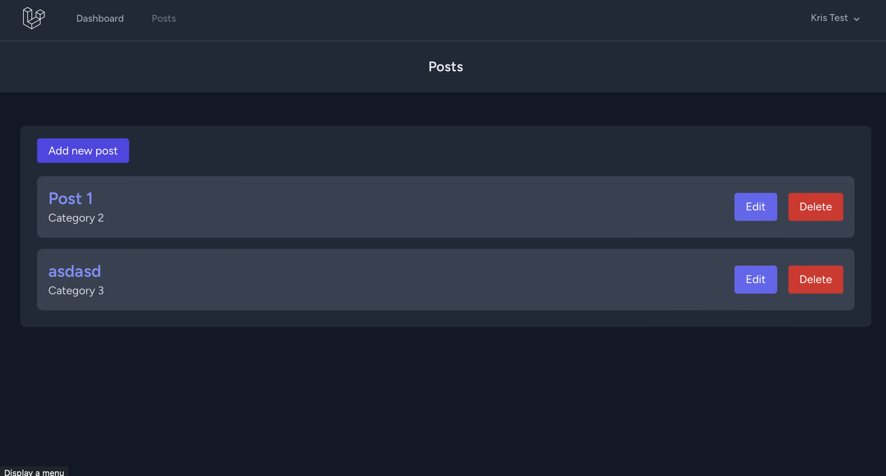

[](https://choosealicense.com/licenses/mit)

## Table of Contents
* [Description](#description)
* [Table of Contents](#table-of-contents)
* [Installation](#installation)
* [Usage](#usage)
* [Walkthrough](#walkthrough)
* [Link](#link)
* [Authors](#authors)
* [Contributors](#contributors)
* [Release](#release)
* [License](#license)

#

## Description


This is a simple blog post application built with Laravel. The application allows users to create, read, update, and delete blog posts. Each post can be categorized into different categories, making it easier to organize and manage content. Additionally, the application includes user authentication functionality, allowing users to register, log in, and manage their posts securely.

Key features of the application include:
- User authentication (registration, login, logout)
- CRUD operations for blog posts (create, read, update, delete)
- Categorization of posts
- Responsive design using Tailwind CSS


#

## Technologies Used

Laravel 11, MySQL, TailWind,

## Installation

You can clone the git repository and run next command to use tha web application locally

Install all dependencies

```
  composer install
```
```
  cp .env.example .env
```

```
  edit the .env file in the root of the directory  to connect to your database like so
    DB_CONNECTION=mysql
    DB_HOST=127.0.0.1
    DB_PORT=3306
    DB_DATABASE=blog
    DB_USERNAME=root "your-user"
    DB_PASSWORD=123456789 "your-pass"
```
```
  php artisan key:generate
```

```
  php artisan migrate
```

```
  npm install
```
```
  npm run dev
```
```
  php artisan serve
```
```
  Access the Application: Open your web browser and navigate to http://localhost:8000.
```
```
  You will have to manually amend the field is_admin to 1 in the database in order to be able to create categories other wise you will not be able to create a post because there is a constrain on the post to require a category, it will be improved in the future.
```

#

## Usage

In order to use the program you will need to clone the repository from GitHub provided in the link below.

#

## How to Contribute

For and suggestions or contributions you can reach me at my email address or you can clone to code and edit it the way it will suite you the best.
I will need to implement a functionality to only show the user post in future for editing and delting 

#

## Walkthrough Video
#
[](https://drive.google.com/file/d/1CUPlycpYJvFonVBGSEnxoRJ-wOgy0awm/view?usp=sharing)
#

## Link

Link to repository:

https://github.com/kristefov/laravel-blog


## Authors

- [Kristiyan](https://github.com/kristefov)

#

## License

- This application is covered under: [MIT License](https://choosealicense.com/licenses/mit)
